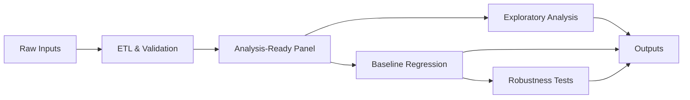
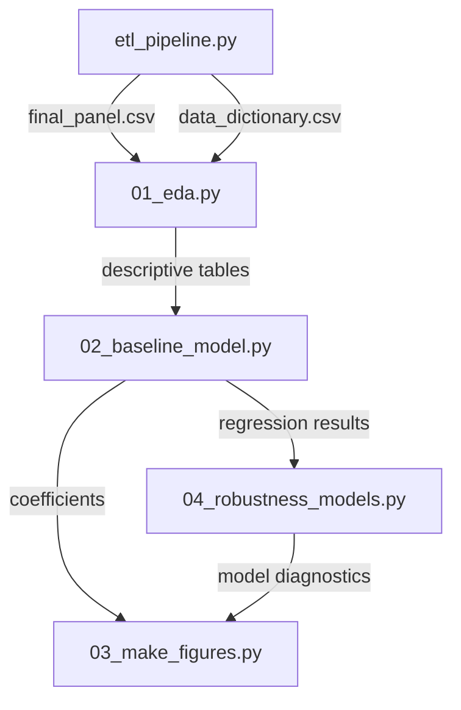

# Bank Balance-Sheet Conditions and Credit Growth in India (FY2002–FY2024)

An empirical analysis examining the relationship between bank balance-sheet conditions—capital adequacy, risk exposure, and asset quality—and aggregate credit growth in India. The project implements a reproducible analytics pipeline covering data preparation, exploratory analysis, econometric modeling, and robustness validation.

---

## Overview

In bank-dominated financial systems, credit supply dynamics reflect not only borrower demand and macroeconomic conditions, but also intermediary balance-sheet constraints. Capital buffers, risk-weighted asset dynamics, and non-performing loan ratios can materially influence banks' capacity and willingness to extend credit, particularly during periods of financial stress.

This project explores these mechanisms using annual aggregate data for India spanning FY2002–FY2024. The objective is to construct a clean, interpretable empirical framework that examines these relationships systematically over time.

**Key features:**
- Modular, reproducible pipeline architecture
- Transparent data transformations and validation
- Regression analysis with robustness specifications
- Automated figure generation and diagnostic exports

---

## Analytical Framework

### Workflow Architecture



### Pipeline Structure

Each script performs a discrete task with explicit inputs and outputs:



---

## Data Specification

- **Frequency:** Annual
- **Coverage:** FY2002–FY2024 (23 observations)
- **Unit of observation:** Aggregate banking system
- **Source:** Curated extracts from public statistical releases

### Core Variables

| Variable | Definition |
|----------|------------|
| **Credit growth** | Year-over-year log growth of aggregate bank credit |
| **Capital buffer** | Capital surplus ratio (excess above regulatory minimum) |
| **Risk exposure** | Change in risk-weighted assets relative to total assets |
| **Asset quality** | Net non-performing asset (NPA) ratio |
| **GDP growth** | Nominal GDP growth (macroeconomic control) |
| **Leverage** | Total assets relative to equity (balance-sheet control) |

---

## Econometric Approach

The baseline specification regresses aggregate credit growth on balance-sheet indicators and macroeconomic controls using OLS with heteroskedasticity-robust standard errors.

Given the annual frequency and limited sample size, results are interpreted as conditional correlations rather than causal estimates. The emphasis is on empirical coherence, specification transparency, and robustness validation.

### Estimation Strategy

1. **Baseline model:** Full specification with all balance-sheet and macro controls
2. **Alternative specifications:** 
   - Replacement of capital buffer with raw CRAR
   - Core risk exposure only (excluding auxiliary risk metrics)
   - Exclusion of GDP control to assess balance-sheet channel isolation
3. **Robustness validation:** Model comparison metrics and coefficient stability tests

---

## Key Empirical Patterns

### Temporal Dynamics

- **Credit growth:** Elevated in mid-2000s, moderated through 2010s, contracted sharply in 2020–2021, rebounded thereafter
- **Capital buffers:** Declined during late-2010s, rebuilt substantially post-2020
- **Asset quality:** Improved through late-2000s, deteriorated mid-2010s, steady improvement from 2018 onward

### Regression Findings

The baseline specification reveals:
- **Asset quality:** Higher net NPA ratios consistently associate with lower credit growth (statistically significant, economically meaningful)
- **Risk dynamics:** Risk-weight changes show detectable correlation with credit growth
- **Capital buffers:** Coefficient displays specification sensitivity, motivating robustness analysis

Complete regression tables, diagnostic statistics, and specification comparisons are exported as structured CSV files.

---

## Repository Structure

```
.
├── etl_pipeline.py              # Data extraction, transformation, validation
├── 01_eda.py                    # Exploratory data analysis
├── 02_baseline_model.py         # Core regression specification
├── 03_make_figures.py           # Automated visualization generation
├── 04_robustness_models.py      # Alternative specifications
├── outputs/
│   ├── figures/                 # PNG exports of all visualizations
│   ├── tables/                  # CSV exports of regression and diagnostic tables
│   └── data/                    # Intermediate data artifacts
├── final_panel.csv              # Analysis-ready dataset
└── data_dictionary.csv          # Variable documentation
```

### Generated Outputs

**Tables:**
- `eda_summary.csv` — Descriptive statistics
- `correlation_core.csv` — Correlation matrix for key variables
- `baseline_regression.csv` — Primary regression results
- `robustness_model_metrics.csv` — Model comparison statistics
- `spec_1_baseline.csv` through `spec_4_drop_gdp_control.csv` — Alternative specifications

**Figures:**
- Credit growth time series
- Capital surplus evolution
- NPA ratio trajectory
- Capital surplus vs. credit growth scatter

---

## Reproducibility

Execute scripts sequentially to replicate all results:

```bash
python etl_pipeline.py
python 01_eda.py
python 02_baseline_model.py
python 03_make_figures.py
python 04_robustness_models.py
```

Each script produces deterministic outputs with no manual intervention required. All transformations, modeling decisions, and diagnostic procedures are fully specified in code.

---

## Limitations and Scope

This analysis operates within several constraints:

- **Statistical power:** Annual frequency and 23-year sample limit inference precision
- **Endogeneity:** Reverse causality between balance-sheet conditions and credit growth not formally addressed
- **Aggregation:** System-level data obscure heterogeneity across individual banks
- **Interpretation:** Results represent conditional correlations, not identified causal effects

The project prioritizes transparency, reproducibility, and empirical coherence over causal identification.

---

## Extension Opportunities

Potential directions for further development:

- **Dynamic specifications:** Lag structures, vector autoregression, error correction models
- **Alternative definitions:** Bank-specific capital ratios, sectoral credit decomposition
- **Automation:** Unit tests, continuous integration, parameterized configuration
- **Interactivity:** Dashboard for result exploration and sensitivity analysis
- **Granularity:** Bank-level panel data to capture cross-sectional heterogeneity

---

## Context

This project implements the intermediary balance-sheet channel within a simplified empirical framework suitable for portfolio demonstration and methodological reference. It is designed as a foundation for extensions rather than a definitive empirical statement.

The codebase emphasizes analytical clarity, modular design, and reproducible workflows—principles transferable to applied research in macroeconomics, financial stability analysis, and policy evaluation.